<div align="center">

# ♡ Olá! Eu sou a Giovanna Victoria ♡

### 💻 Estudante de Desenvolvimento de Sistemas

<p align="center">
  
  
</p>

🌹 Bem-vindo(a) ao meu GitHub! 🌹

[](https://github.com/)
[](mailto:giannavictoriamorais.silva@gmail.com)

</div>

---

## 🌷 Sobre mim

Olá! Eu sou **Giovanna Victoria**, estudante de **Desenvolvimento de Sistemas**.

Atualmente estou construindo meus conhecimentos na área de tecnologia e buscando evoluir cada vez mais na programação e no desenvolvimento de sistemas.

🎓 **Desenvolvimento de Sistemas — SENAI PR**  
📚 **Ensino Médio — Sesi CIC**  
💻 Interesse em **Tecnologia da Informação** e **Análise de Sistemas**

---

## 🩷 Objetivos

Meu objetivo é crescer profissionalmente na área de tecnologia, colocando meus conhecimentos em prática e adquirindo novas experiências.

🌹 Busco oportunidades como:

- 💻 Técnico de TI
- 🖥️ Estágio na área de Análise de Sistemas
- 🌱 Oportunidades para aprender e desenvolver novas habilidades

---

## ❀Habilidades❀

```text
╭────────────────────────────────────╮
│  ♡ Boa comunicação                 │
│  ♡ Trabalho em equipe              │
│  ♡ Flexibilidade                   │
│  ♡ Informática                     │
│  ♡ Organização                     │
│  ♡ Planejamento                    │
│  ♡ Gestão do tempo                 │
│  ♡ Aprendizado contínuo            │
│  ♡ Empatia                         │
│  ♡ Postura profissional             │
╰────────────────────────────────────╯
